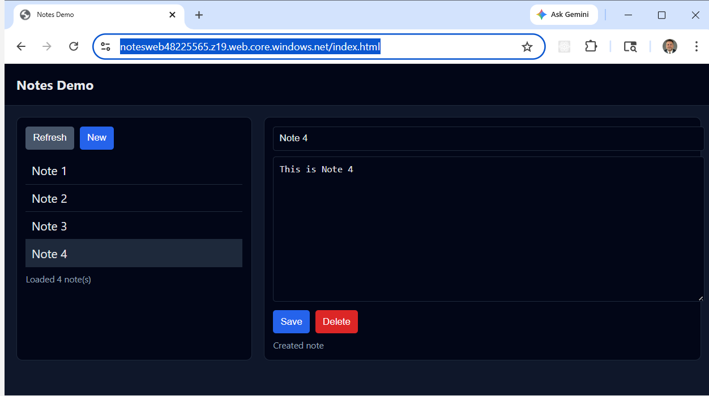
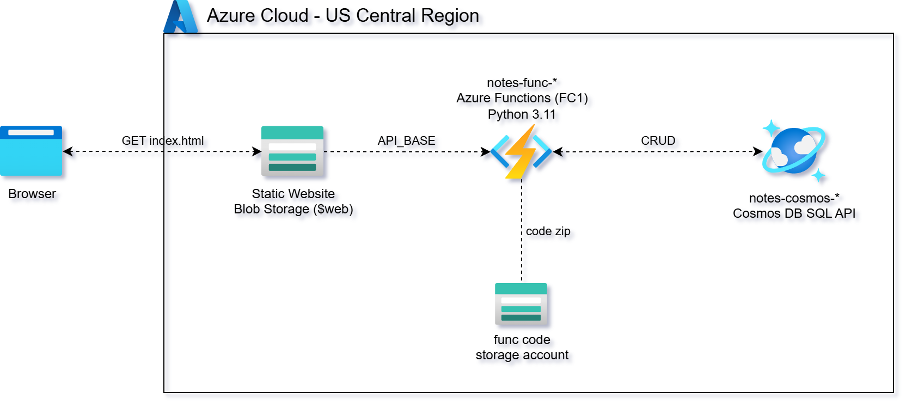

# Azure Serverless CRUD API with Azure Functions, Cosmos DB, and Blob Storage

This project delivers a fully automated **serverless CRUD (Create, Read, Update,
Delete) API** on Azure, built using **Azure Functions**, **Azure Cosmos DB**, and
**Azure Blob Storage**.

It uses **Terraform** and **Python (azure-cosmos)** to provision and deploy a
**stateless, REST-style backend** that exposes HTTP endpoints for managing simple
"notes" data — all without running or managing any virtual machines.

For testing and demonstration purposes, a lightweight **HTML web frontend**
interacts directly with the deployed API, allowing users to create, view, update,
and delete notes from a browser.



This design follows a **serverless microservice architecture** where Azure
Functions handle HTTP routing and business logic, Cosmos DB provides fully
managed NoSQL persistence, and Blob Storage hosts the static frontend.



Key capabilities demonstrated:

1. **Serverless CRUD API** — Implements REST-style endpoints using the Azure
   Functions Python v2 programming model for creating, retrieving, listing,
   updating, and deleting records.
2. **Stateless Compute Layer** — All five operations are handled by a single
   Function App on a consumption plan — zero idle cost, scales on demand.
3. **Managed NoSQL Storage** — Uses Cosmos DB (SQL API) with a provisioned
   throughput container, partition key `/owner`, and UUID-based item IDs.
4. **Infrastructure as Code (IaC)** — Terraform provisions the Function App,
   Cosmos DB account, Blob Storage static site, and all supporting resources
   in a repeatable, auditable way.
5. **Browser-Based Test Client** — A simple static HTML frontend demonstrates
   real-time interaction with the API without requiring additional tooling.

---

## API Endpoints

The **Notes API** exposes REST-style CRUD endpoints through **Azure Functions
HTTP triggers**. All endpoints return JSON and accept both CLI and browser-based
clients.

> Note: In this simplified demo, the note `owner` is hardcoded to `"global"` in
> the function code.

### Endpoint Summary

| Method | Path | Purpose | Input | Cosmos DB Operation |
|---|---|---|---|---|
| POST | `/api/notes` | Create a new note | JSON body (`title`, `note`) | `create_item` |
| GET | `/api/notes` | List all notes | None | `query_items` (owner = "global") |
| GET | `/api/notes/{id}` | Retrieve a single note | Path param (`id`) | `read_item` |
| PUT | `/api/notes/{id}` | Update an existing note | Path param + JSON body | `replace_item` |
| DELETE | `/api/notes/{id}` | Delete a note | Path param (`id`) | `delete_item` |

### Request & Response Characteristics

| Aspect | Behavior |
|---|---|
| Authentication | None (demo-only, `AuthLevel.ANONYMOUS`) |
| Content Type | `application/json` |
| Owner Model | Hardcoded to `"global"` |
| Response Format | JSON |
| Clients | curl, browser, any HTTP client |
| Error Handling | Standard HTTP status codes |

---

### POST /api/notes

**Request Body:**
```json
{ "title": "Test Note 1", "note": "This is test note 1" }
```

**Response (201):**
```json
{
  "id": "2f2d0c5a-9f5f-4d7d-9e2c-1c8a5b8e3c21",
  "title": "Test Note 1",
  "note": "This is test note 1"
}
```

**Example:**
```bash
curl -s -X POST https://<func-app>.azurewebsites.net/api/notes \
  -H "Content-Type: application/json" \
  -d '{"title":"Test Note 1","note":"This is test note 1"}'
```

---

### GET /api/notes

**Response (200):**
```json
{
  "items": [
    {
      "id": "2f2d0c5a-9f5f-4d7d-9e2c-1c8a5b8e3c21",
      "title": "Test Note 1",
      "note": "This is test note 1",
      "created_at": "2026-01-19T14:12:09.123456+00:00",
      "updated_at": "2026-01-19T14:12:09.123456+00:00"
    }
  ]
}
```

---

### GET /api/notes/{id}

```bash
curl -s https://<func-app>.azurewebsites.net/api/notes/<id>
```

---

### PUT /api/notes/{id}

**Request Body:**
```json
{ "title": "Updated Title", "note": "Updated content" }
```

---

### DELETE /api/notes/{id}

```bash
curl -s -X DELETE https://<func-app>.azurewebsites.net/api/notes/<id>
```

---

## Prerequisites

* [An Azure Account](https://portal.azure.com/)
* [Install Azure CLI](https://docs.microsoft.com/en-us/cli/azure/install-azure-cli)
* [Install Terraform](https://developer.hashicorp.com/terraform/install)
* [Install jq](https://jqlang.github.io/jq/download/)

## Download this Repository

```bash
git clone https://github.com/mamonaco1973/azure-crud-example.git
cd azure-crud-example
```

## Build the Code

Run [check_env.sh](check_env.sh) to validate your environment, then run
[apply.sh](apply.sh) to provision all infrastructure and deploy the function code.

```bash
~/azure-crud-example$ ./apply.sh
NOTE: Found required command: az
NOTE: Found required command: terraform
NOTE: Found required command: jq
NOTE: Azure CLI authentication successful.
NOTE: Deploying functions and Cosmos DB...

Initializing the backend...
```

`apply.sh` performs the following steps in order:

1. Runs `check_env.sh` to validate required CLI tools and Azure authentication
2. Deploys `01-functions` — resource group, Cosmos DB account/database/container,
   storage account, service plan, and Function App
3. Packages and deploys the Python function code via `az functionapp deployment source config-zip`
4. Substitutes the Function App URL into `02-webapp/index.html.tmpl`
5. Deploys `02-webapp` — storage account with static website hosting, uploads `index.html`
6. Runs `validate.sh` to exercise all five CRUD endpoints

To tear down all resources:

```bash
./destroy.sh
```

---

### Build Results

When the deployment completes, the following resources are created:

- **Resource Groups:**
  - `notes-rg` — functions, Cosmos DB, and supporting resources
  - `notes-webapp-rg` — static website storage account

- **Azure Cosmos DB:**
  - Account with Session consistency and GlobalDocumentDB kind
  - Database `notes` with container `notes`
  - Partition key `/owner` — all items use `"global"` in this demo
  - Item ID is a UUID; Cosmos DB `id` field serves as the unique key within the partition

- **Azure Functions:**
  - Linux consumption plan (`Y1` SKU) — serverless, pay-per-execution
  - Python 3.11 runtime with Python v2 programming model
  - Single `function_app.py` implementing all five routes with `@app.route` decorators
  - CORS configured to allow all origins
  - Cosmos DB endpoint and key injected via app settings

- **Static Web App (Blob Storage):**
  - Storage account with static website hosting enabled
  - `index.html` uploaded to the `$web` container
  - Frontend calls the Function App URL directly from the browser

- **Automation & Validation:**
  - `apply.sh` / `destroy.sh` / `check_env.sh` automate provisioning, teardown, and validation
  - `validate.sh` creates 5 notes, lists, gets, updates, and deletes each — all via curl

---

## Project Structure

```
azure-crud-example/
├── 01-functions/
│   ├── code/
│   │   ├── function_app.py    # All 5 Azure Functions (Python v2 model)
│   │   ├── requirements.txt   # azure-functions, azure-cosmos
│   │   └── host.json          # Extension bundle configuration
│   ├── main.tf                # Provider, resource group, random suffix
│   ├── cosmosdb.tf            # Cosmos DB account, database, container
│   ├── functions.tf           # Storage, service plan, Function App, code deployment
│   └── outputs.tf             # function_app_name, function_app_url, resource_group_name
├── 02-webapp/
│   ├── index.html.tmpl        # Frontend template (${API_BASE} substituted at deploy)
│   ├── main.tf                # Provider, resource group
│   └── storage.tf             # Storage account, static website, blob upload
├── apply.sh                   # Full deployment orchestrator
├── destroy.sh                 # Teardown in reverse order
├── validate.sh                # End-to-end CRUD test
└── check_env.sh               # Validates az, terraform, jq, and auth
```
